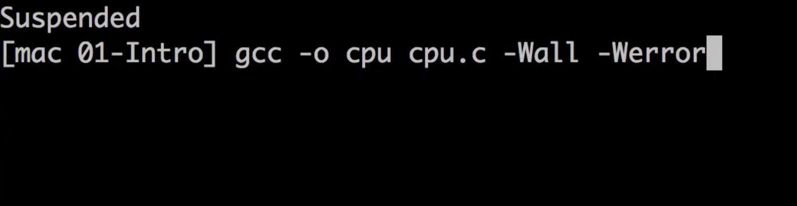
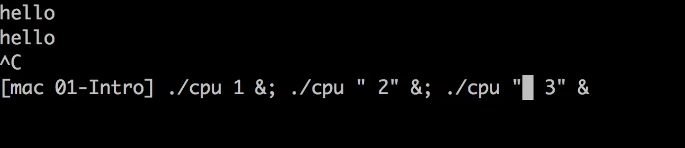
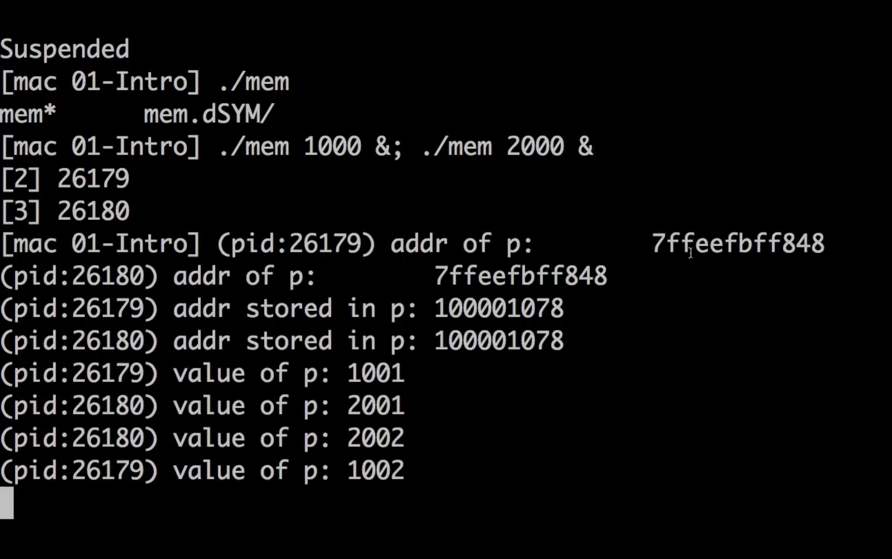
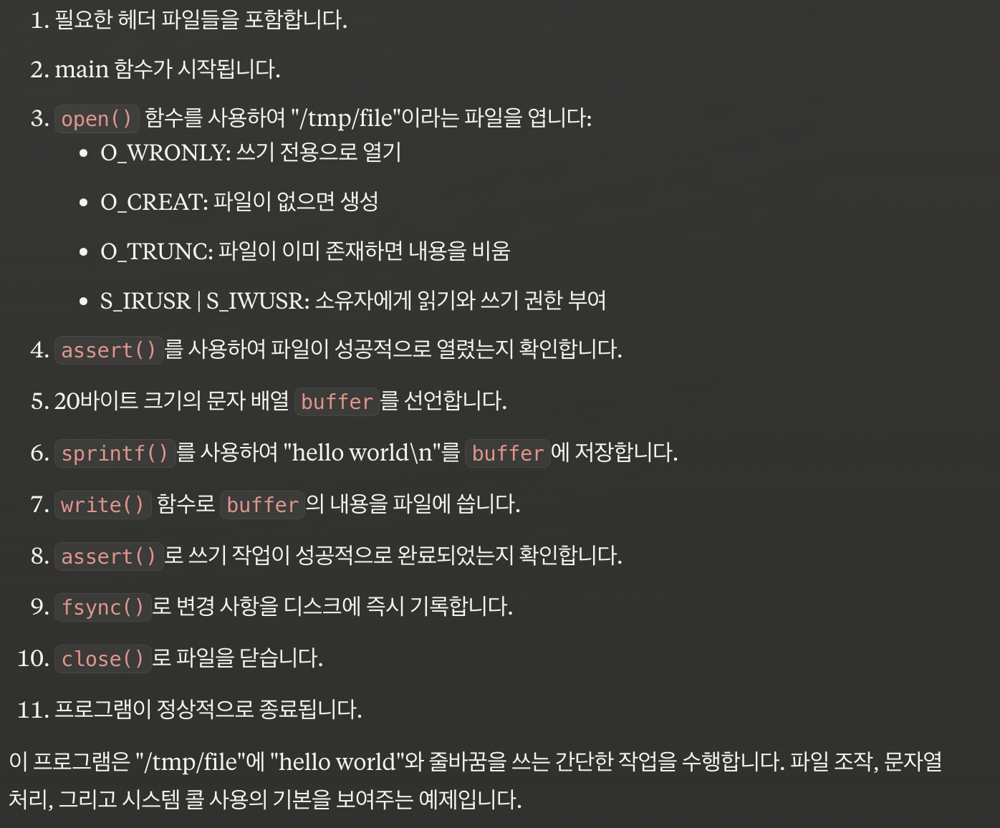
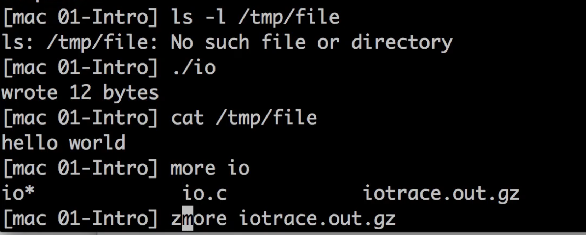
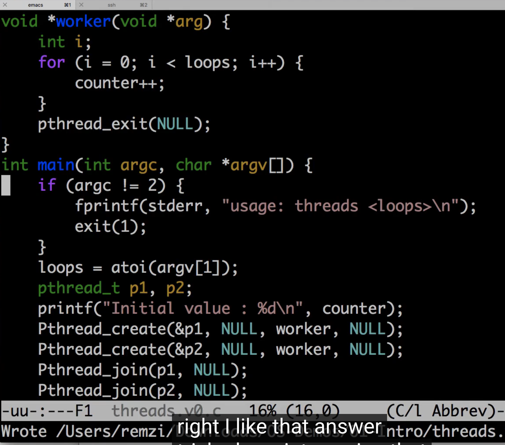
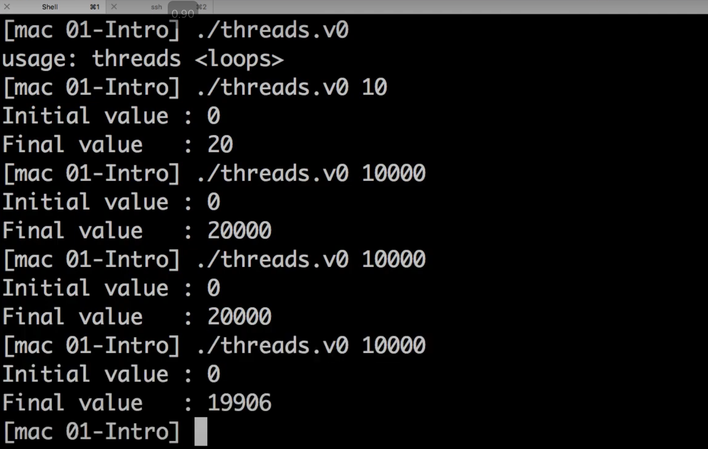

##### 

~~~c
#include <stdio.h>
#include <stdlib.h>
#include "common.h"

int main(int argc, char *argv[]) {
    if (argc != 2) {
        fprintf(stderr, "usage: cpu <string>\n");
        exit(1);
    }
    char *str = argv[1];
    while (1) {
        printf("\s\n", str);
        Spin(1);
    }
    return 0;
}
~~~

~~~c
#include <stdio.h>
#include <unistd.h>
#include <assert.h>
#include <fcntl.h>
#include <sys/stat.h>
#include <sys/types.h>
#include <string.h>

int main(int argc, char *argv[]) {
    int fd = open("/tmp/file", O_WRONLY | O_CREAT | O_TRUNC, S_IRUSR | S_IWUSR);
    assert(fd >= 0);
    char buffer[20];
    sprintf(buffer, "hello world\n");
    int rc = write(fd, buffer, strlen(buffer));
    assert(rc == (strlen(buffer)));
    fsync(fd);
    close(fd);
    return 0;
}
~~~

~~~c
#include <stdio.h>
#include <stdlib.h>
#include "common.h"
#include "common_threads.h"

volatile int counter = 0; 
int loops;

void *worker(void *arg) {
    int i;
    for (i = 0; i < loops; i++) {
	counter++;
    }
    return NULL;
}

int main(int argc, char *argv[]) {
    if (argc != 2) { 
	fprintf(stderr, "usage: threads <loops>\n"); 
	exit(1); 
    } 
    loops = atoi(argv[1]);
    pthread_t p1, p2;
    printf("Initial value : %d\n", counter);
    Pthread_create(&p1, NULL, worker, NULL); 
    Pthread_create(&p2, NULL, worker, NULL);
    Pthread_join(p1, NULL);
    Pthread_join(p2, NULL);
    printf("Final value   : %d\n", counter);
    return 0;
}
~~~

race condition

---

C books recommendation

- Advanced programming in the UNIX env
- Expert C
- learn C the hard way

---

impeachment

trap vs interupt

refute

obscure

She was choosen for the job on a basis of her qualification

fiasco

---

