# The Abstraction: The Process

## Homework (Simulation)

This program, `process-run.py`, allows you to see how process states change as programs run and either use the CPU (e.g., perform an addin struction) or do I/O (e.g., send a request to a disk and wait for it to complete). See the README for details.

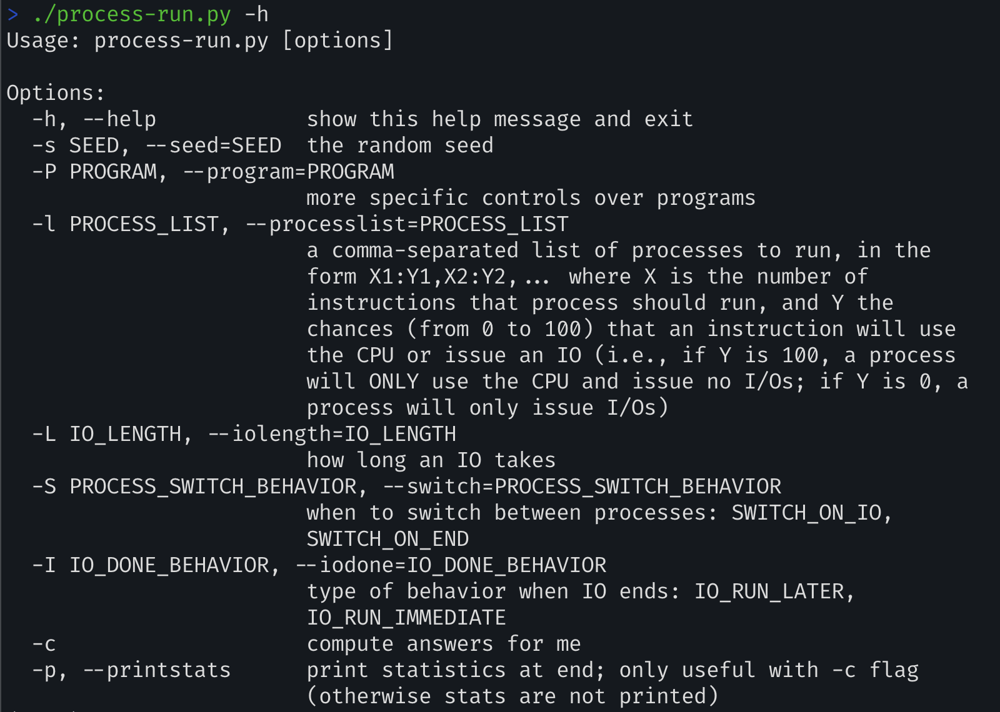

---

### Questions

1. ##### Run `process-run.py` with the following flags: `-l 5:100,5:100`. What should the CPU utilization be (e.g., the percent of time the CPU is in use?) Why do you know this? Use the `-c` and `-p` flags tosee if you were right.

   `./process-run.py -l 5:100,5:100` 실행 결과

   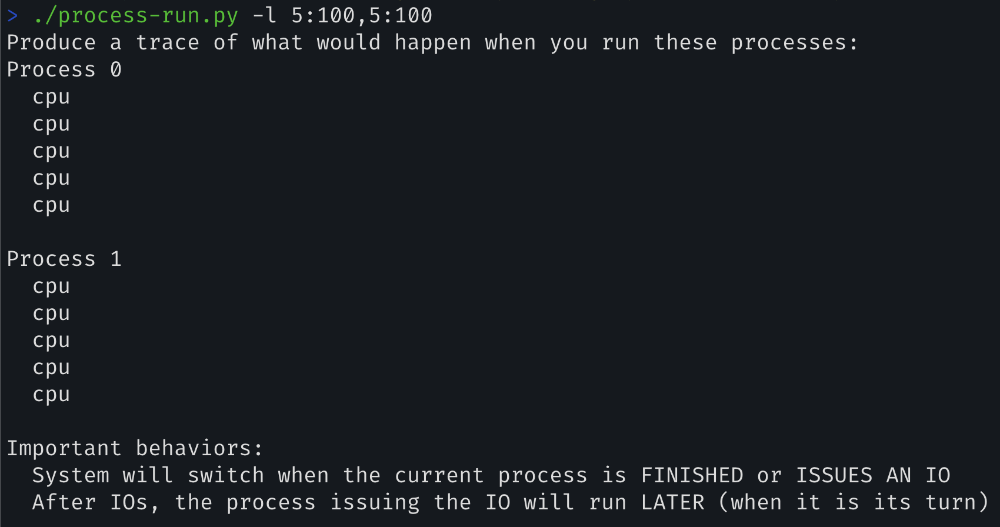

   CPU이용률 = `(CPU가 사용된 시간 / 전체 시간) * 100`

   10개의 시간단위 동안 CPU는 항상 사용중이었으므로 정답은 100%이다.

   

   `./process-run.py -l 5:100,5:100 -c` 실행 결과

   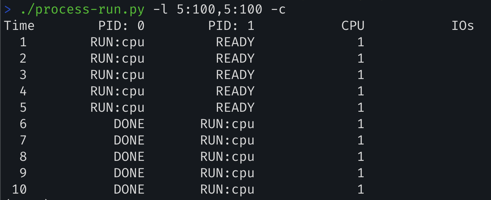

   ---

2. ##### Now run with these flags: `./process-run.py -l 4:100,1:0`.These flags specify one process with 4 instructions (all to use the CPU), and one that simply issues an I/O and waits for it to be done.How long does it take to complete both processes? Use `-c` and `-p` to find out if you were right.

   

   `./process-run.py -l 4:100,1:0` 실행 결과

   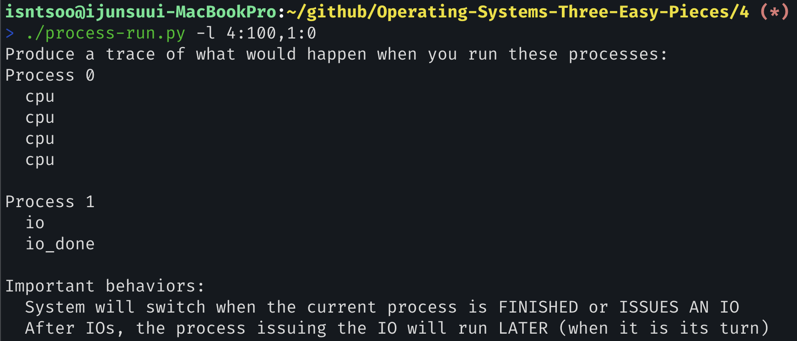

   11개의 시간단위가 소요된다. 그리고 CPU는 6/11, IO는 5/11 만큼의 비율을 차지한다. 즉, CPU 이용률은 `54.55%`이다.

   아래에서 각각의 프로세스를 기준으로, 살펴본다.

   `PID: 0`: 

   - **time 1-4**: CPU의 서비스를 받음. 그 이후 완료(DONE)

   `PID: 1`: 

   - time 1-4: `READY`, ready queue에서 순서를 기다림
   - **time 5**: `RUN_io` IO작업 시작(CPU 필요)
   - time 6-10: `BOLCKED`, IO작업 진행 중
     - IO 작업 자체(time 6-10)는 CPU를 필요로 하지 않으며, IO 장치가 독립적으로 작업을 수행한다.
     - <u>IO 작업의 시작과 완료 처리(time5, 11)에서는 CPU가 관여한다.</u> (ex. 시스템콜, 프로세스 업데이트, 메모리 복사 등을 위함)
   - **time 11**: `io_DONE`, IO작업 완료 및 프로세스 종료(CPU 필요)

   따라서, time 1-4, time 5, time 11에서 CPU가 이용된다.

   

   `./process-run.py -l 4:100,1:0 -c -p` 실행 결과

   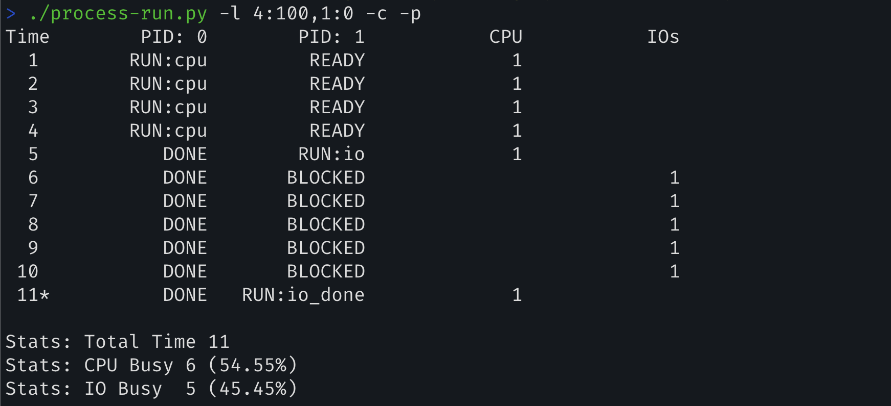

   ---

3. ##### Switch the order of the processes: `-l 1:0,4:100`. What happens now? Does switching the order matter? Why? (As always, use `-c` and `-p` to see if you were right)

   

   `./process-run.py -l 1:0,4:100` 실행 결과

   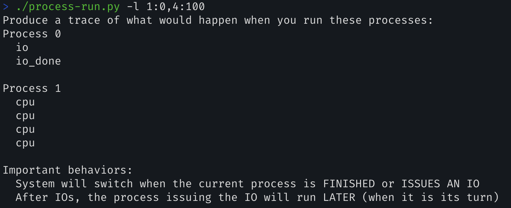

   > I/O-bound-task: CPU의 사용 시간보다, 디스크를 읽거나 사용자의 입력을 기다리는 등, I/O 작업을 기다리는 시간이 크다. 

   정답: 7개의 time unit이 소요된다.

   각각의 프로세스를 기준으로 살펴보면,

   `PID: 0`

   - **time1**: I/O 작업을 요청하기 위해 CPU의 서비스를 받음
   - time 2-6: I/O 작업 진행중
   - **time 7**: I/O 작업 완료 처리를 위한 CPU의 사용

   `PID: 1`

   - time 1: READY
   - **time 2-5**: RUN, 그 이후로 DONE

   따라서, CPU의 이용률은 7개의 time unit 중, time1, time 2-5, time7 동안 CPU를 이용하므로(CPU busy: 6) 85.71%이다.

   

   `./process-run.py -l 1:0,4:100 -c -p` 실행 결과

   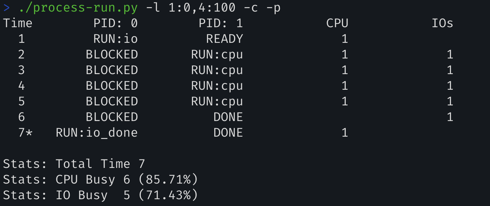

   Now process 1 runs when process 0 is waiting for IO completes.

   ---

4. ##### We’ll now explore some of the other flags. One important flag is `-S`, which determines how the system reacts when a process issues an I/O. With the flag set to `SWITCH_ON_END`, the systemwill NOT switch to another process while one is doing I/O, instead waiting until the process is completely finished. What happens when you run the following two processes (`-l 1:0,4:100 -c -S SWITCH_ON_END`), one doing I/O and the other doing CPU work?

   

   `./process-run.py -l 1:0,4:200 -c -S SWITCH_ON_END -p` 실행 결과

   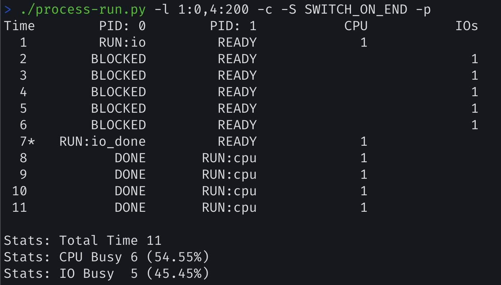

   `-S` flag를 `SWITCH_ON_END`로 지정하면 I/O를 요청한 프로세스가 입출력을 기다리는 동안 다른 프로세스로 전환하지 않는다. 

   이 결과로 `PID: 0`이 I/O 작업을 진행 중(대기 중)인 동안 `PID: 1`으로 전환하지 않아 CPU는 IDLE하게 되므로 CPU의 이용률이 85.71%에서 54.55%로 떨어졌다.

   

   ---

5. ##### Now, run the same processes, but with the switching behavior set to switch to another process whenever one is WAITING for I/O (`-l 1:0,4:100 -c -S SWITCH_ON_IO`). What happens now? Use `-c` and `-p` to confirm that you are right.

   

   `./process-run.py -l 1:0,4:100`

   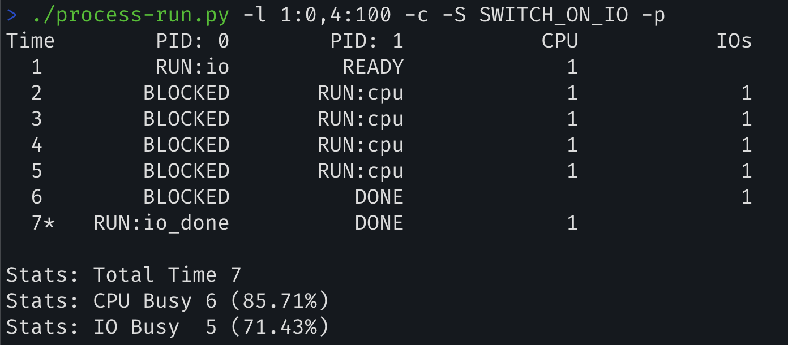

   두 프로세스가 존재할 때, 하나의 프로세스가 I/O 작업을 위하여 `BLOCK` 상태일 때 다른 프로세스로 전환하여 CPU의 서비스를 받게 하는 것(`RUN` 하는 것)이 CPU이용률과 I/O 이용률을 높이는 핵심인 것으로 보인다.

   위 문제(4번)에서는, 전환을 하지 못하게 된 결과 하나의 프로세스는 `BOLCK`, 나머지 하나의 프로세스는 `READY` 상태, 즉 CPU가 IDLE하였으나,

   본 문제에서는 `SWITCH_ON_IO`으로 설정하여 현재 process가 `BLOCK`상태(I/O 작업이 진행 중이며 프로세스는 대기 중)일 때 다른 process로 전환하여 CPU가 IDLE하지 않도록 하여 이용률을 높였다.

   

   ---

6. ##### One other important behavior is what to do when an I/O completes. With `-I IO_RUN_LATER`, when an I/O completes, the process that issued it is not necessarily run right away; rather, whatever was running at the time keeps running. What happens when you run this combination of processes? (Run `./process-run.py -l 3:0,5:100,5:100,5:100 -S SWITCH_ON_IO -I IO_RUN_LATER -c -p`) Are system resources being effectively utilized?

   

   `./process-run.py -l 3:0,5:100,5:100,5:100 -S SWITCH_ON_IO -I IO_RUN_LATER -c -p` 실행 결과

   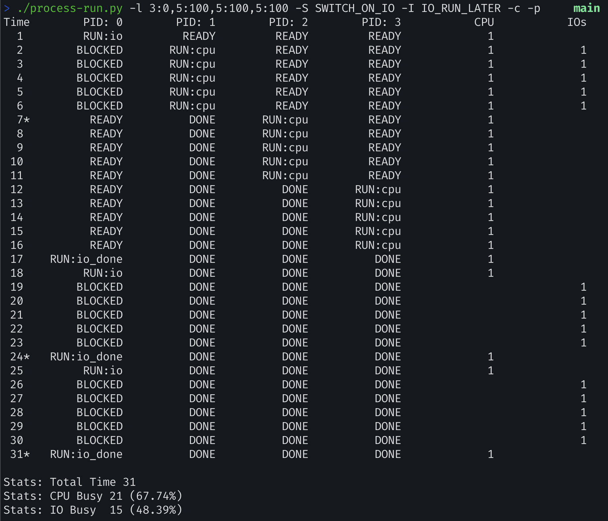

   `IO_RUN_LATER` flag를 설정함으로써, I/O 작업이 완료된 후 해당 작업이 나중에 실행되도록 하였다. 이것은 보다 중요한 프로세스가 실행되도록 우선순위를 조정하는 기법으로 사용될 수 있지만,

   본 문제에서는 time unit의 후반부에 `PID: 0`이 `BLOCK`된 상태로 머무는 시간이 많고 CPU가 IDLE한 것으로 보아 개선의 여지가 보인다.

   시스템의 자원은 효과적으로 활용되고 있지 않다.

   

   ---

7. ##### Now run the same processes, but with `-I IO_RUN_IMMEDIATE` set, which immediately runs the process that issued the I/O. How does this behavior differ? Why might running a process that just completed an I/O again be a good idea?

   `./process-run.py -l 3:0,5:100,5:100,5:100 -S SWITCH_ON_IO -I IO_RUN_IMMEDIATE -c -p` 실행 결과

   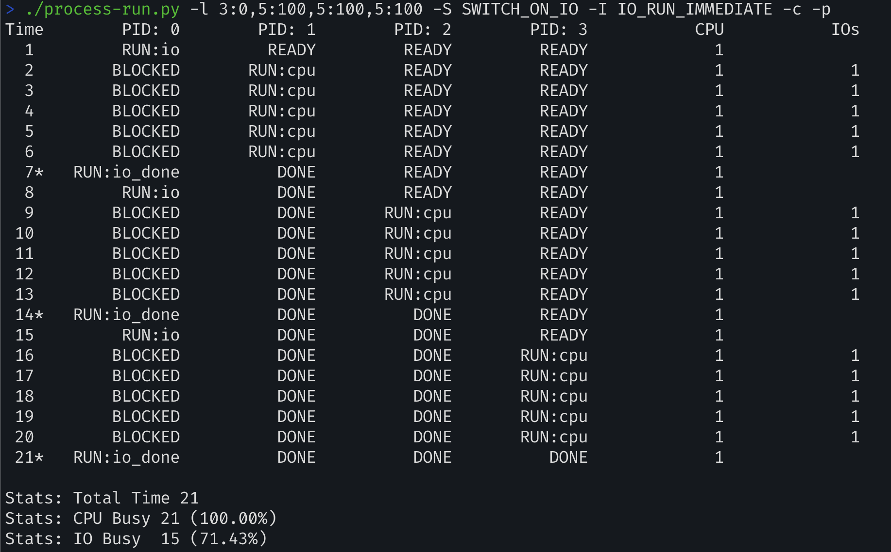

   위 문제와 비교하였을 때, 1) time unit이 31 -> 21로 감소하였고, 2) 이에 따라 CPU의 이용률이 100%(from 21/31 to 21/21)로 개선되었다. 그리고 3) I/O 이용률 역시 개선되었다(from 15/31 to 15/21).

   이것은 방금 입출력을 완료한 프로세스를 곧바로 다시 실행시켜 `BLOCK`상태로 만들고, I/O 작업이 진행 중인 동안 다른 프로세스로 전환시켜, CPU의 서비스를 받도록 하여 효율을 높였기 때문이다.

   > process가 BLOCK 상태인 것은 I/O 작업이 진행 중이며, process는 대기 중인 것으로 치환시켜 이해함.

   ---

8. ##### Now run with some randomly generated processes: `-s 1 -l 3:50,3:50` or `-s 2 -l 3:50,3:50` or `-s 3 -l 3:50,3:50`. See if you can predict how the trace will turn out. What happens when you use the flag `-I IO_RUN_IMMEDIATE` vs. `-I IO_RUN_LATER`? What happens when you use `-S SWITCH_ON_IO` vs. `-S SWITCH_ON_END`?

   

   > ~~크게 도움이 되는 문제인지는 모르겠다, 특히 -s 옵션에 대해서 이해가 되지 않고~~, 
   >
   > `SWITCH_ON_END` 와 `IO_RUN_LATER` flags가 효율을 떨어뜨리는 것 같으로 보인다.
   >
   > => feedback: seed 값은 설정하여 다양한 결과를 확인할 수 있다. 동일한 seed는 동일한 결과를 보장한다.

   여러 가지 커맨드를 동작시켜본 결과,

   - -s option에 대하여, `./process-run.py -s 2 -l 3:50,3:50 -p -c` 명령어가 가장 효율이 좋았다.

     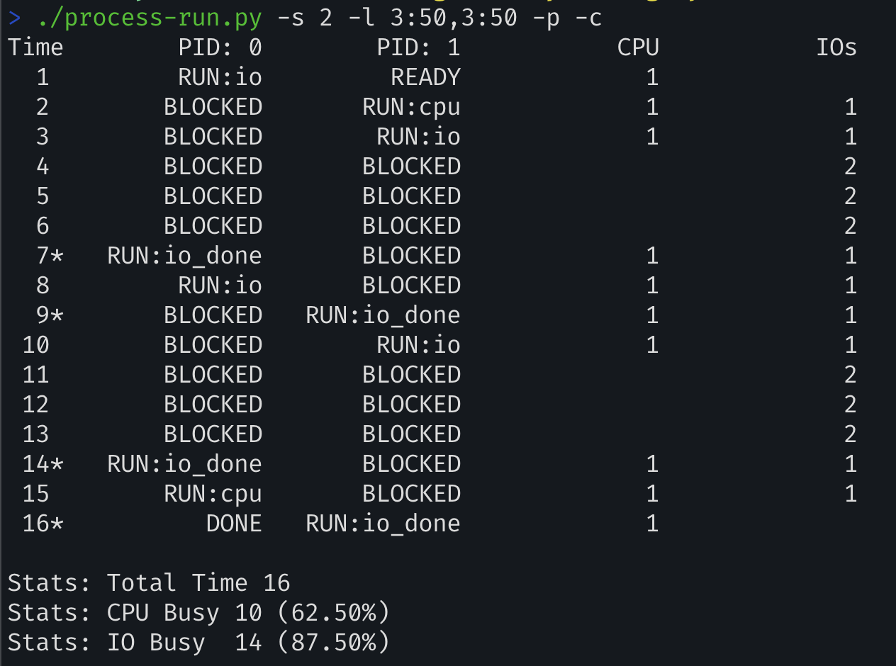

   - `IO_RUN_IMMEDIATE` and `SWITCH_ON_IO`

     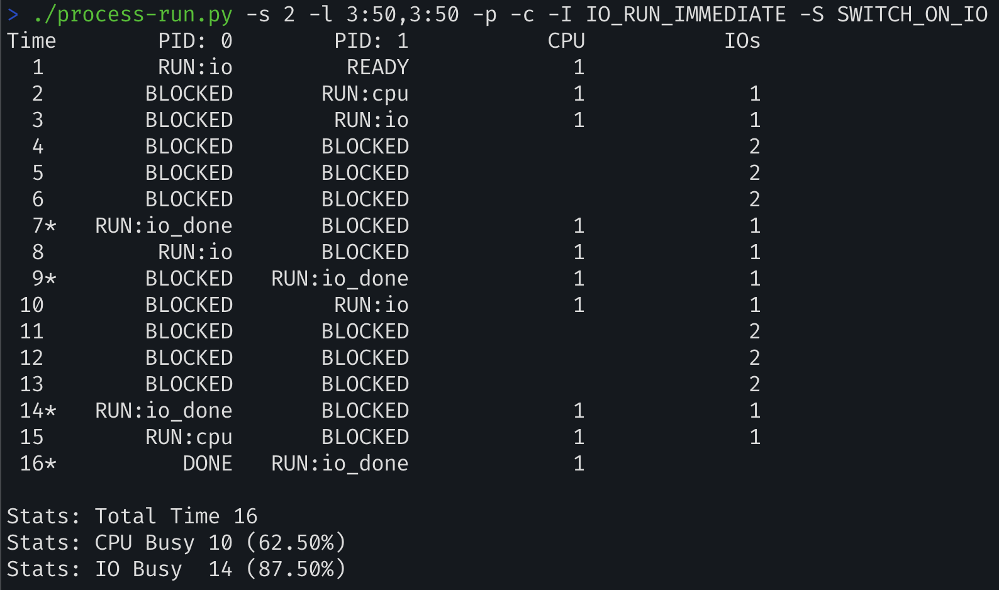

   - `IO_RUN_IMMEDIATE` and `SWITCH_ON_END` - 효율 나쁨

     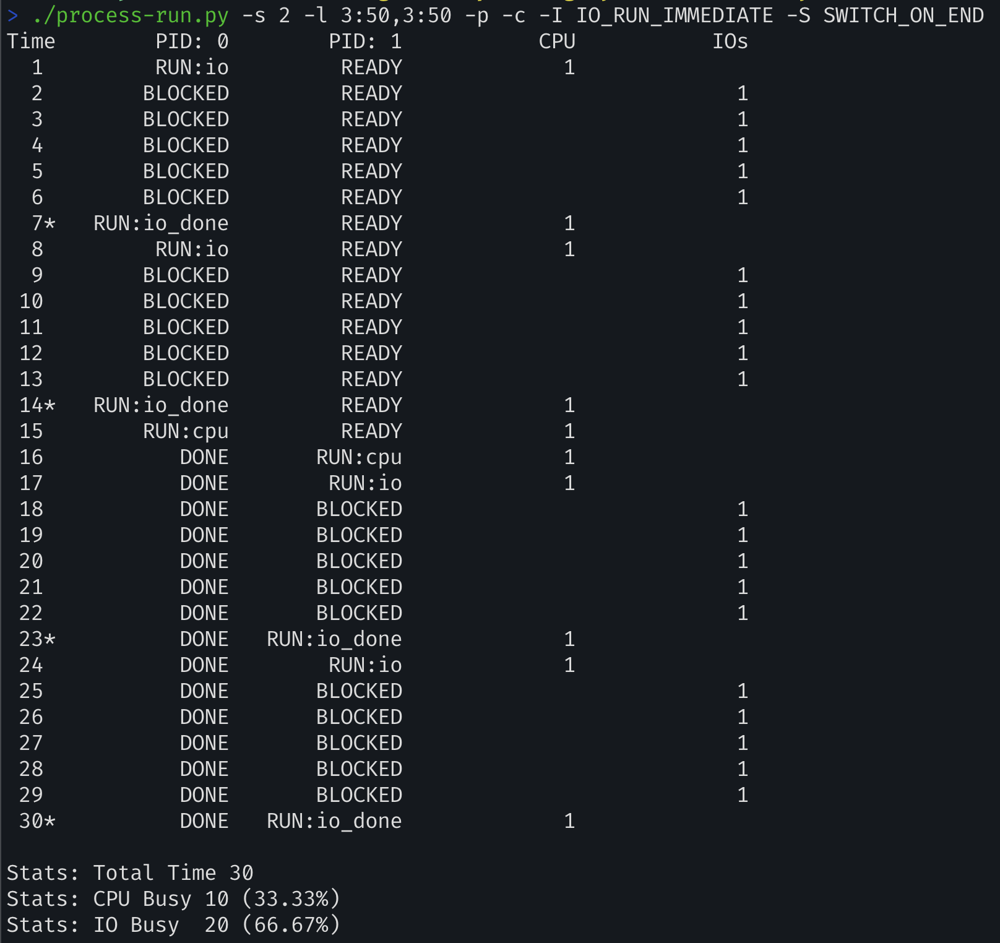

   - `IO_RUN_LATER` and `SWITCH_ON_IO` - `-s` 옵션을 `3`으로 바꿨을 땐 `IO_RUN_IMMEDIATE`보다 CPU효율이 떨어졌다.

     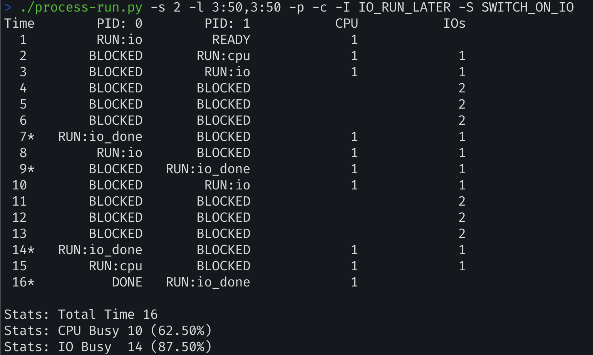

   - `IO_RUN_LATER` and `SWITCH_ON_END` - 효율 나쁨

     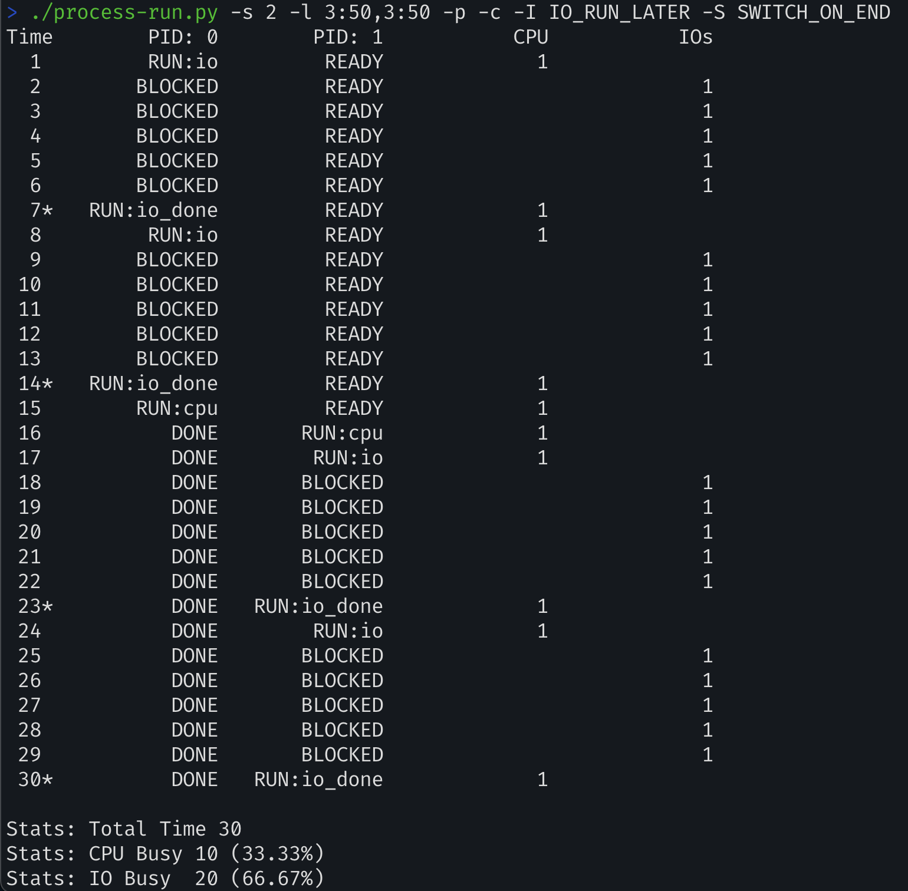

   