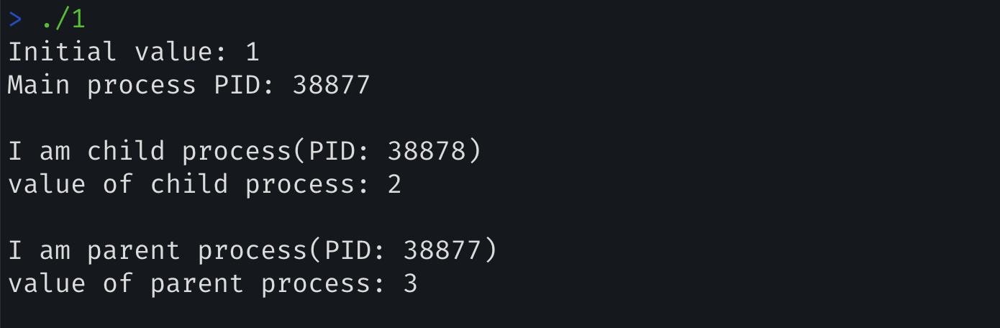

## Homework (Code)

In this homework, you are to gain some familiarity with the process management APIs about which you just read. Don’t worry – it’s even more fun than it sounds! You’ll in general be much better off if you find as much time as you can to write some code, so why not start now?

### Questions

1. Write a program that calls `fork()`. Before calling `fork()`, have the main process access a variable (e.g., `x`) and set its value to something (e.g., `100`). What value is the variable in the child process? What happens to the variable when both the child and parent change the value of `x`?

   

   ~~~c
   #include <stdio.h>
   #include <stdlib.h> // exit()
   #include <unistd.h>
   #include <sys/wait.h>
   
   int main() {
   	int x = 1;
       printf("Initial value: %d\n", x);
   	printf("Main process PID: %d\n\n", (int)getpid());
   	int rc = fork();
   	if (rc < 0) {
   		fprintf(stderr, "fork failed\n");
   		exit(1);
   	} else if(rc == 0) {
   		x = 2;
   		printf("I am child process(PID: %d)\n", (int) getpid());
   		printf("value of child process: %i\n\n", x);
   	} else {
   		x = 3;
           wait(NULL);
   		printf("I am parent process(PID: %d)\n", (int) getpid());
   		printf("value of parent process: %i\n\n", x);
   		// wait(NULL);
   	}
   
   
   	return 0;
   }
   ~~~

   - zombie process를 생성하지 않기 위해 `wait()` system call을 호출한다. 덕분에 main process가 child process가 종료될 때까지 대기 상태이다. 이를 통해 실행 순서를 제어할 수 있다.


   >  **문제의 의도 💭 - 프로세스 복제 메커니즘에 대한 이해**
   >
   > main process는 fork() system call을 호출하여 자신의 복사본인 child process를 생성한다. 이 두 프로세스는 “거의” 동일한 복사본이다(PID 등 다름).
   >
   > 1. fork() 호출 전에 설정한 변수값이 자식 프로세스에게 상속될까?(O, 따라서 **`x = 1`은 자식 프로세스에게 상속**됨),
   >
   > 2. 이후에 변수를 변경할 때 서로에게 영향을 미칠까?(X, **두 프로세스는 서로 독립적인 메모리 공간을 갖음**)

   

   ---

2. Write a program that opens a file (with the `open()` system call) and then calls `fork()` to create a new process. Can both the child and parent access the file descriptor returned by `open()`? What happens when they are writing to the file concurrently, i.e., at the same time?

   

   ~~~c
   #include <stdio.h>
   #include <stdlib.h>
   #include <unistd.h>
   #include <string.h>
   #include <sys/wait.h>
   #include <fcntl.h>
   
   int main() {
   	// main(parent) process에서 fd를 연다. 이 fd는 자식에게 상속 및 공유될까?
   	int fd = open("p2.output", O_CREAT | O_WRONLY | O_TRUNC, 644);
   	if (fd == -1) {
   		fprintf(stderr, "Failed to open file\n");
   		exit(1);
   	}
   
       // child process 생성
   	int rc = fork();
   	if (rc < 0){
   		fprintf(stderr, "Fork failed\n");
   		close(fd);
   		exit(1);
   	} else if (rc == 0) {
   		char *message = "This is child process\n";
   		write(fd, message, strlen(message));
   	} else {
   		char *message = "This is parent process\n";
   		write(fd, message, strlen(message));
   		wait(NULL);
   	}
   
   	close(fd);
   	return 0;
   }
   ~~~

   > **문제의 의도💭 - fd의 상속과 동시 접근 가부**: O
   >
   > - `fork()` 후에 child process가 main process(parent process)의 file descriptor를 상속할 수 있을까? **yes**, 두 process 모두 fd에 access 할 수 있다. 이로 인해 동시성 문제가 발생할 수 있을 것 같다.
   >
   > - 두 프로세스(parent, child)는 동일한 fd를 사용하여 같은 file 쓰기 작업을 수행하여 **동시 쓰기가 가능**했다. 동시성 문제가 발생하지 않도록 `wait()` 사용했다.

   > About `open()` system call

   

   > About `write()` system call

   

   ---

3. Write another program using `fork()`. The child process should print “hello”; the parent process should print “goodbye”. You should try to ensure that the child process always prints first; can you do this *without* calling **wait()** in the parent?

   ~~~c
   #include <stdio.h>
   #include <unistd.h>
   #include <stdlib.h>
   
   int main() {
   
   	int rc = fork();
   	if (rc < 0) {
   		fprintf(stderr, "fork failed\n");
   		exit(1);
   	} else if(rc == 0) {
   		printf("hello\n");
   	} else {
   		sleep(1);
   		printf("goodbye\n");
   	}
   
   	return 0;
   }
   ~~~

   > 문제의 의도 - 프로세스 간의 실행 순서 제어를 할 수 있겠는가? 간단하게 `sleep()`을 사용했다. signal이나 pipe를 이용하는 방법도 가능하다.

   

4. Write a program that calls `fork()` and then calls some form of `exec()` to
   run the program `/bin/ls`. See if you can try all of the variants of `exec()`, including(on Linux)`execl()`, `execle()`, `execlp()`, `execv()`, `execvp()`, and `execvpe()`. Why do you think there are so many variants of the same basic call?

   ##### `exec()`

   > : 현재 프로세스를 다른 프로세스로 대체(전환)한다. 이 과정에서 command line arguments(+ env)를 전달한다.
   >
   > - 현재 프로세스의 memory space를 새 프로그램이 덮어쓴다. 다만 **file descriptor, PID는 그대로 유지된다.**
   >
   > > 탄생 배경: 취지 - `system()`
   > >
   > > - 코드 안에서 다른 프로그램을 쉽게 실행할 수 있다.
   > > - 어떤 프로그램이라도 쉽게 실행할 수 있다는 것은 보안상의 문제가 된다. 
   > >   - 따라서 사용자가 직접 command line arguments와 environment variable을 입력하여 원하는 프로그램을 호출하는 방법이 필요하다. 이를 위하여 `exec()`가 필요하다.
   >
   > - 어느 라이브러리에 존재? `unistd.h`
   > - `exec()`의 첫 번째 인자는 파일의 이름(경로)가 된다.
   > - 명령행 인자의 첫 번째 인자도 파일의 이름(경로)가 된다. 마지막 인자는 NULL이다.
   > - 명령행 인자들을 어떤 형태로 전달하느냐에 따라 구체적인 종류가 달라진다.
   >
   > 종류
   >
   > - 명령행 인자들을 list로 나열하는 경우 `execl()`, array의 형태로 묶어서 전달하는 경우 `execv()`
   >   - `l`: 인자를 개별적으로 나열
   >   - `v`: 문자열 배열로 전달
   > - 프로그램의 이름이 PATH에 존재하는 경우 `...p`
   >   - `p`: PATH 환경변수 사용
   > - 환경변수도 전달하는 경우 `...e`
   >   - `e`: 환경변수 지정
   >
   > 반환값 1) 성공 시 반환하지 않고(현재 프로그램은 중단됨), 2) 실패 시 -1을 반환(현재 프로그램 재개)한다.
   >
   > 커맨드라인을 작성하는 느낌으로 함수를 작정하자.
   >
   > 예시
   >
   > ~~~c
   > #include <stdio.h>
   > #include <unistd.h>
   > #include <string.h>
   > #include <errno.h>
   > 
   > int main() {
   > 	if (execl("/sbin/ifconfig", "/sbin/ifconfig", NULL) == -1)
   > 		if (execlp("ipconfig", "ipconfig", NULL) == -1) {
   > 			fprintf(stderr, "Cannot run ipconfig: %s", strerror(errno));
   > 			return 1;
   > 		}
   > 	return 0;
   > }
   > ~~~
   >
   > - tip: 환경변수를 어떻게 얻을 수 있을까: `getenv()`, 이는 `stdlib.h`에 존재한다.

   

   `execl()`

   ~~~c
   #include <stdio.h>
   #include <unistd.h>
   #include <sys/types.h>
   #include <stdlib.h>
   #include <sys/wait.h>
   
   int main() {
   
   	pid_t rc = fork();
   	if (rc == -1) {
   		perror("fork failed.");
   		exit(1);
   	} else if (rc == 0) {
   		if (execl("/bin/ls", "/bin/ls", "-l", NULL) == -1) {
   			perror("execution failed");
   			exit(1);
   		}
   	} else {
   		// parent process
   		wait(NULL);
   		printf("child process completed.\n");
   	}
   
   	return 0;
   }
   ~~~

   - 각 디렉토리 경로는 콜론(:)으로 구분

   

   `execle()`

   ~~~c
   #include <stdio.h>
   #include <unistd.h>
   #include <sys/types.h>
   #include <stdlib.h>
   #include <sys/wait.h>
   
   int main() {
   
   	pid_t rc = fork();
   	if (rc == -1) {
   		perror("fork failed.");
   		exit(1);
   	} else if (rc == 0) {
   		char *envp[] = { "PATH=/bin:/bin/ls", "TERM=console", NULL };
   
   		if (execle("/bin/ls", "ls", "-l", NULL, envp) == -1) {
   			perror("execution failed");
   			exit(1);
   		}
   	} else {
   		// parent process
   		wait(NULL);
   		printf("child process completed.\n");
   	}
   
   	return 0;
   }
   ~~~

   

   `execlp()`

   ~~~c
   #include <stdio.h>
   #include <unistd.h>
   #include <sys/types.h>
   #include <stdlib.h>
   #include <sys/wait.h>
   
   int main() {
   
   	pid_t rc = fork();
   	if (rc == -1) {
   		fprintf(stderr, "fork failed\n");
   		exit(1);
   	} else if (rc == 0) {
   		if (execlp("ls", "ls", "-l", NULL) == -1) {
   			fprintf(stderr, "excution failed");
   			exit(1);
   		}
   	} else {
   		// parent process
   		wait(NULL);
   		fprintf(stdout, "child process completed.\n");
   	}
   
   	return 0;
   }
   ~~~

   > 에러처리  - `perror()`
   >
   > what? 현재 설정된 errno 값에 해당하는 에러 메시지를 출력.
   >
   > where? stdlib.h
   >
   > why? `fprintf(stderr, "...")` 보다 명확하고 표준화된 방식

   

   `execv()`

   ```c
   #include <stdio.h>
   #include <unistd.h>
   #include <sys/types.h>
   #include <stdlib.h>
   #include <sys/wait.h>
   
   int main() {
   
   	pid_t rc = fork();
   	if (rc == -1) {
   		perror("fork failed.");
   		exit(1);
   	} else if (rc == 0) {
   		char *v[] = { "/bin/ls", "-l", NULL };
   
   		if (execv("/bin/ls", v) == -1) {
   			perror("execution failed");
   			exit(1);
   		}
   	} else {
   		// parent process
   		wait(NULL);
   		printf("child process completed.\n");
   	}
   
   	return 0;
   }
   ```

   

   `execvp()`: PATH 환경변수를 이용한다.

   ```c
   #include <stdio.h>
   #include <unistd.h>
   #include <sys/types.h>
   #include <stdlib.h>
   #include <sys/wait.h>
   
   int main() {
   
   	pid_t rc = fork();
   	if (rc == -1) {
   		perror("fork failed.");
   		exit(1);
   	} else if (rc == 0) {
   		char *v[] = { "ls", "-l", NULL };
   
   		if (execvp("ls", v) == -1) {
   			perror("execution failed");
   			exit(1);
   		}
   	} else {
   		// parent process
   		wait(NULL);
   		printf("child process completed.\n");
   	}
   
   	return 0;
   }
   ```

   

   `execve()`: 환경변수를 전달한다.

   ```c
   #include <stdio.h>
   #include <unistd.h>
   #include <sys/types.h>
   #include <stdlib.h>
   #include <sys/wait.h>
   
   int main() {
   
   	pid_t rc = fork();
   	if (rc == -1) {
   		perror("fork failed.");
   		exit(1);
   	} else if (rc == 0) {
   		char *v[] = { "ls", "-l", NULL };
   		char *envp[] = {"PATH=/bin:/bin/ls", "TERM=console", NULL};
   
   		if (execve("/bin/ls", v, envp) == -1) {
   			perror("execution failed");
   			exit(1);
   		}
   	} else {
   		// parent process
   		wait(NULL);
   		printf("child process completed.\n");
   	}
   
   	return 0;
   }
   ```

   

   Q. 동일한 기능을 수행하는 시스템 콜에 여러 변형이 있는 이유? 

   프로그래머에게 다양한 선택지를 제공함으로써 개발을 조금 더 용이하게 할 수 있다. 1) 환경 변수를 직접 제어하거나(`e`) 2) PATH 환경 변수를 사용(`p`)하거나 3) 인자를 전달하는 방식(`l` 또는 `v`) etc...

   