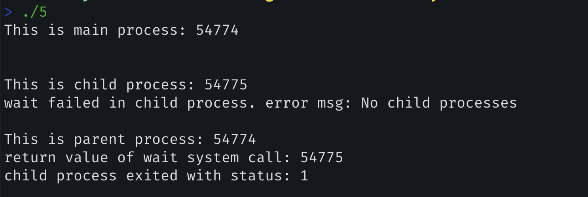
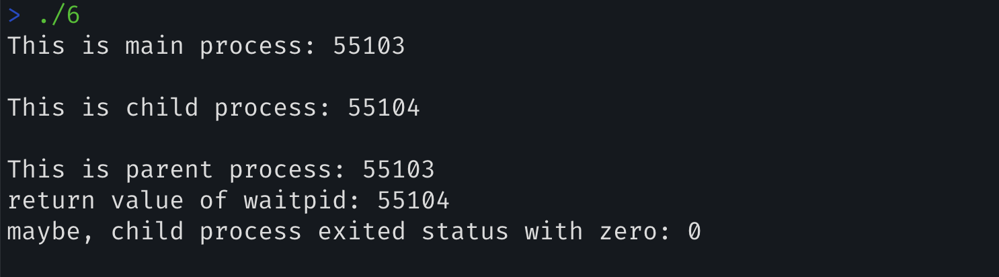

5. Now write a program that uses `wait()` to wait for the child process to finish in the parent. What does `wait()` return? What happens if you use `wait()` in the child?

   > 문제의 의도: 
   >
   > `wait()`의 return value가 child process의 PID임을 확인할 수 있다.

   

   ```c
   #include <unistd.h>
   #include <stdlib.h>
   #include <sys/wait.h>
   #include <sys/types.h>
   #include <stdio.h>
   
   int main() {
   	printf("This is main process: %d\n\n", (int) getpid());
   	pid_t rc = fork();
   	if (rc == -1) {
   		perror("fork failed");
   		exit(1);
   	} else if (rc == 0) {
   		// child process
   		pid_t wait_result = wait(&rc);
   		if (wait_result == -1) {
   			printf("\nThis is child process: %d\n", (int) getpid());
   			perror("wait failed in child process. error msg");
   			exit(1);
   		}
   	} else {
   		// parent process
   		pid_t wait_result = wait(&rc);
   		printf("\nThis is parent process: %d\n", (int) getpid());
   		if (wait_result != -1) {
   			printf("return value of wait system call: %d\n", wait_result);
   			if (WEXITSTATUS(rc)) {
   				printf("child process exited with status: %d\n\n", WEXITSTATUS(rc));
   			}
   		} else {
   			perror("wait failed in parent process.");
   			exit(1);
   		}
   	}
   	return 0;
   }
   ```

   > About `wait()`
   >
   > `pid_t wait(int *status_ptr);`
   >
   > 동작
   > - (호출한) 부모 프로세스는 block, 자식 상태가 종료될 때 까지 대기
   > - 자식 프로세스가 이미 종료된 경우, 즉시 반환
   >
   > `status_ptr`
   > - 종료된 자식 프로세스의 종료 상태
   > - 매크로(WIFEXITED, WEXITSTATUS 등)를 통해 확인할 수 있음
   >
   > 반환 값
   > - 종료된 자식 프로세스의 PID
   > - 다만, 실패 시(자식 프로세스가 없는 경우) -1을 즉시 반환하며 errno를 설정함.
   >
   > 주 용도: 좀비 프로세서 방지
   >
   > where? `sys/wait.h`

   

   > WIFEXITED(*status_ptr)
   > This macro evaluates to a nonzero (true) value if the child process ended normally, that is, if it returned from main() or called one of the exit() or _exit() functions.
   >
   > WEXITSTATUS(*status_ptr)
   > When WIFEXITED() is nonzero, WEXITSTATUS() evaluates to the low-order 8 bits of the child's return status passed on the exit() or _exit() function.

   

   `wait()`는 자식 프로세스의 PID를 반환하며, 실패 시 -1을 반환한다. 따라서 자식 프로세스가 `wait()`호출하면 즉시 -1을 반환한다.


---

6. Write a slight modification of the previous program,this time using `waitpid()` instead of wait(). When would `waitpid()` be useful?

   

   ```c
   #include <unistd.h>
   #include <stdlib.h>
   #include <sys/wait.h>
   #include <sys/types.h>
   #include <stdio.h>
   
   int main() {
   	printf("This is main process: %d\n\n", (int) getpid());
   	pid_t rc = fork();
   	if (rc == -1) {
   		perror("fork failed");
   		exit(1);
   	} else if (rc == 0) {
   			// child process
   			printf("This is child process: %d\n", (int) getpid());
   			exit(0);
   	} else {
   		// parent process
   		int status;
   		pid_t wait_result = waitpid(rc, &status, 0);
   		printf("\nThis is parent process: %d\n", (int) getpid());
   		if (wait_result != -1) {
   			printf("return value of waitpid: %d\n", wait_result);
   			if (WEXITSTATUS(status) == 0)
   				printf("maybe, child process exited status with zero: %d\n\n", WEXITSTATUS(status));
   		} else {
   			perror("waitpid failed in parent process.");
   			exit(1);
   		}
   	}
   
   	return 0;
   
   }
   ```

   `waitpid()`는 `wait()`와 비교하였을 때 특정 PID의 자식 프로세스의 종료를 기다리는 경우 적절하다.

   또한, Non-blocking wait이 가능하다.

   > About `waitpid()`
   >
   > ```c
   > pid_t waitpid(pid_t pid, int *status, int options);
   > ```
   >
   > 부모 프로세스가 자식 프로세스의 상태 변화를 기다린다(주로 종료).
   >
   > pid: 기다릴 자식 프로세스의 pid
   >
   > - `pid` == -1: 임의의 자식 프로세스를 기다림(`wait()`와 동일)
   > - etc...
   >
   > `status`: 자식 프로세스의 종료 상태를 저장할 포인터
   >
   > `options`: 동작을 제어하는 flag
   > \- `0`: 자식 프로세스가 종료 될 때까지 블록된다
   > \- ...
   > 반환 값: 1) 성공 시: (상태 변화된)자식 프로세스의 PID, 2) 실패 시: -1(errono 설정)
   > 장점
   >
   > 1. 특정 PID를 가진 자식의 종료만을 기다리고 싶은 경우
   > 2. 비차단 대기 (Non-blocking wait)가 가능하다. `WNOHANG` 옵션을 사용


---

7. Write a program that creates a child process, and then in the child closes standard output (`STDOUT_FILENO`). What happens if the child calls `printf()` to print some output after closing the descriptor?

   ~~~c
   #include <stdio.h>
   #include <unistd.h>
   #include <sys/types.h>
   #include <sys/wait.h>
   #include <stdlib.h>
   
   int main() {
   
   	pid_t rc = fork();
   	if (rc == -1) {
   		perror("fork failed");
   		exit(1);
   	} else if(rc == 0) {
   		// child process
   		if (close(STDOUT_FILENO) == -1) {
   			perror("close failed");
   			exit(1);
   		}
   		printf("Hello, world.\n");
           exit(0);
   	} else {
   		// parent process
   		wait(NULL);
           printf("child process completed.\n");
   	}
   
   
   	return 0;
   }
   ~~~

   `printf()`의 결과 어떠한 것도 출력되지 않는다.

   > 문제의 의도
   >
   > 1. STDOUT_FILENO은 하나의 file descriptor(`1`)에 불과하며 `close()` system call로 닫을 수 있다는 것을 확인할 수 있다
   > 2. `printf()`함수는 내재적으로 표준출력(file descriptor: 1)을 통해 데이터를 보내는 것이다.
   >    - 즉, `printf("Hello, world.\n")`와 `fprintf(stdout, “Hello, world.\n”)`는 동일하다.


---

8. Write a program that creates two children, and connects the standard output of one to the standard input of the other, using the `pipe()` system call.

   ```c
   #include <stdio.h>
   #include <unistd.h>
   #include <sys/wait.h>
   #include <sys/types.h>
   #include <stdlib.h>
   
   int main() {
   
   	int fd[2];
   	if (pipe(fd) == -1) {
   		// pipe failed.
   		perror("piping failed.\n");
   		exit(1);
   	}
   
   	pid_t child1 = fork();
   	if (child1 == -1) {
   		// fork failed.
   		perror("fork child1 failed.\n");
   		exit(1);
   	} else if(child1 == 0) {
   		close(fd[0]);
   		dup2(fd[1], STDOUT_FILENO);
   		close(fd[1]);
   
   		execlp("ls", "ls", NULL);
   		// execlp failed.
   		perror("execlp ls failed.");
   		exit(1);
   	}
   
   	pid_t child2 = fork();
   	if (child2 == -1) {
   		// fork failed.
   		perror("fork child1 failed.\n");
   		exit(1);
   	} else if(child2 == 0) {
   		close(fd[1]);
   		dup2(fd[0], STDIN_FILENO);
   		close(fd[0]);
   
   		execlp("wc", "wc", NULL);
   		// execlp wc failed.
   		perror("execlp wc failed.");
   		exit(1);
   	}
   	// parent process
   	close(fd[0]);
   	close(fd[1]);
   
   	waitpid(child1, NULL, 0);
   	waitpid(child2, NULL, 0);
   
   	return 0;
   }
   ```
   
   - `fork()` system call을 사용하여 두 개의 자식 프로세스를 생성한다.
   - `pipe()` system call을 사용하여 프로세스 간의 통신 채널을 만든다.
   - `dup2()` system call을 사용하여 표준 입출력을 리다이렉트한다.
     - fd table을 조작: STDIN_FILENO`, `STDOUT_FILENO`이 이 파이프의 읽기/쓰기 끝을 가리키도록 변경한다.
   - 프로세스 간의 동기화: 부모 프로세스는 `waitpid()` 를 사용하여 자식 프로세스를 기다린다.