# Interlude: Process API

## Homework (Simulation)

This simulation homework focuses on `fork.py`, a simple process creation simulator that shows how processes are related in a single “familial” tree. Read the relevant README for details about how to run the simulator.

> process tree를 직접 관찰해볼 수 있는 과제이다. 이를 통해 프로세스가 생성되고 소멸(exit)되는 과정, 부모프로세스와 자식프로세스의 관계, 프로세스간의 sibling관계를 시각적으로 이해할 수 있다.

### Questions

1. Run `./fork.py -s 10` and see which actions are taken. Can you predict what the process tree looks like at each step? Use the `-c` flag to check your answers. Try some different random seeds(`-s`) or add more actions(`-a`) to get the hang of it.

   > Process Tree: process들 간의 관계를 시각적으로 구조화한 것, 실행 중인 프로세스들의 계층 구조를 나타낸다.
   >
   > Parent process는 fork() system call을 통해 child process를 생성한다. 이 둘의 PID는 다르다.
   >
   > 동일한 부모를 둔 child processes는 sibling 관계이다.
   >
   > `-s` option 은 seed 값을 설정한다. seed 값을 변경하여 다양한 결과를 얻을 수 있다.
   >
   > 만약 동일한 seed를 설정하면 동일한 결과를 보장한다.

   `src/fork.py -s 10 -c` 실행 결과

   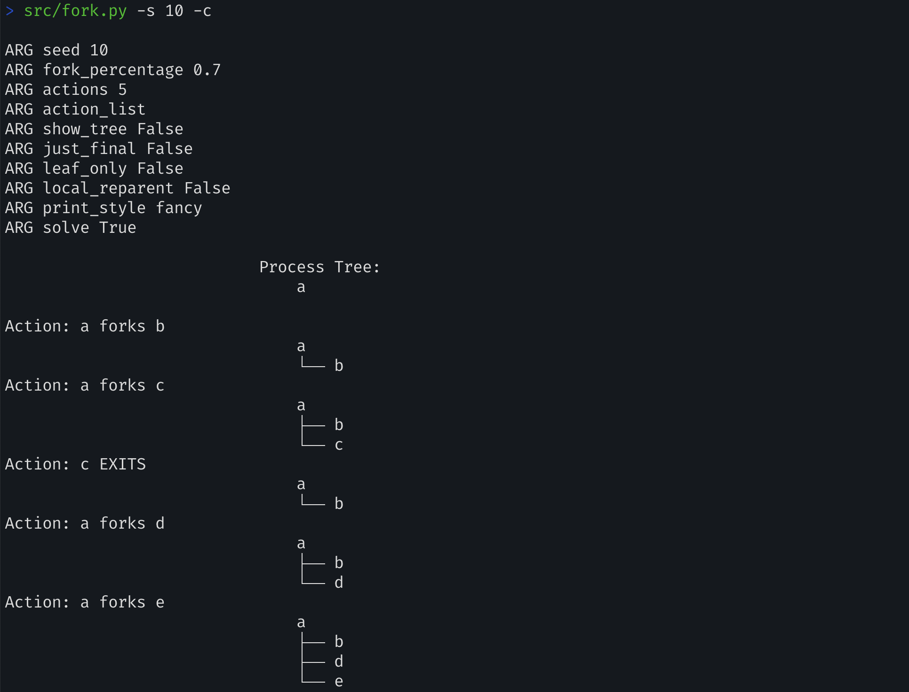

   `src/fork.py -s 2 -a 7 -c` 실행 결과

   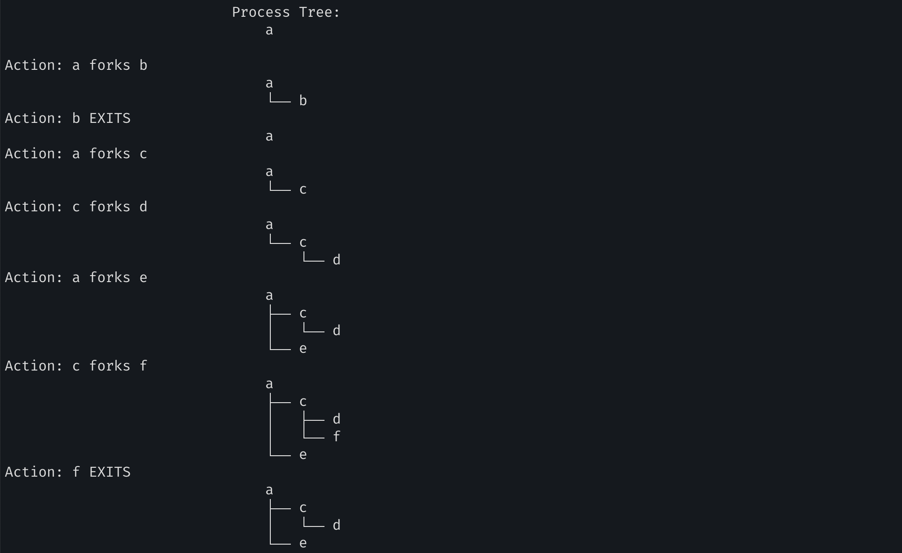

   

   ---

2. One control the simulator gives you is the `fork_percentage`, controlled by the `-f` flag. The higher it is, the more likely the next action is a fork; the lower it is, the more likely the action is an exit. Run the simulator with a large number of actions (e.g., `-a 100`) and vary the fork percentage from 0.1 to 0.9. What do youthink the resulting final process trees will look like as the percentage changes? Check your answer with `-c`.

   

   > `fork_percentage`가 높을 수록 다음 action이 fork일 확률이 높아진다. 반면 낮을 수록 exit할 확률이 높아진다. (0.1-0.9의 범위를 갖는다)

   `src/fork.py -f 0.1 -a 50 -c` 실행 결과: process가 exit할 확률이 높아 process tree의 모양이 1) depth가 낮다, 2) branch가 적다.

   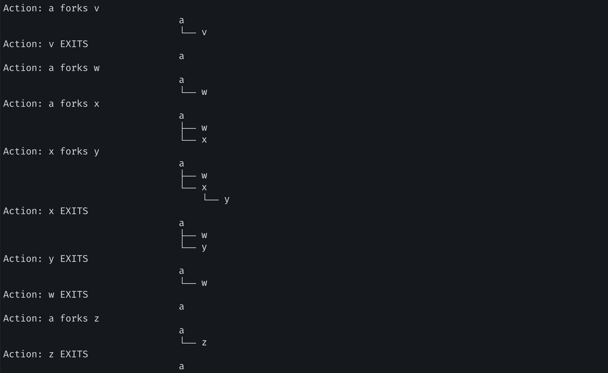

   `src/fork.py -f 0.9 -a 50 -c` 실행 결과: process가 fork할 확률이 높아 process tree의 모양이 1) depth가 높다, 2) branch가 많다.

   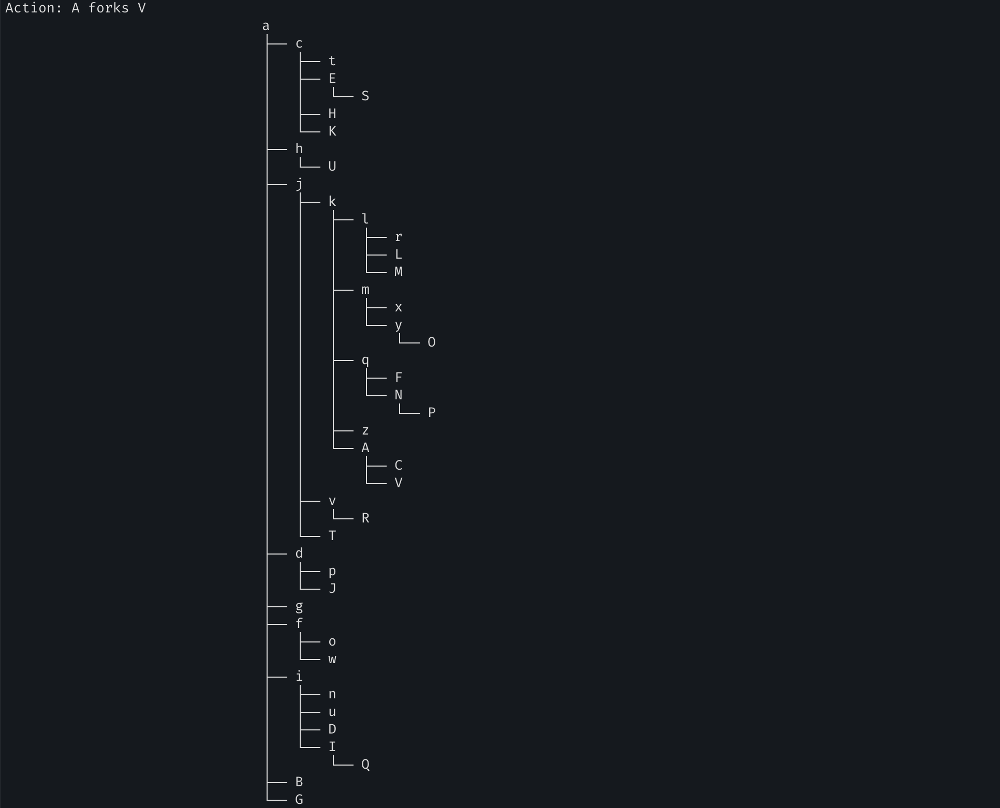

   `src/fork.py -f 0.5 -a 50 -c` 실행 결과: 균형 잡힌 tree를 확인할 수 있다.

   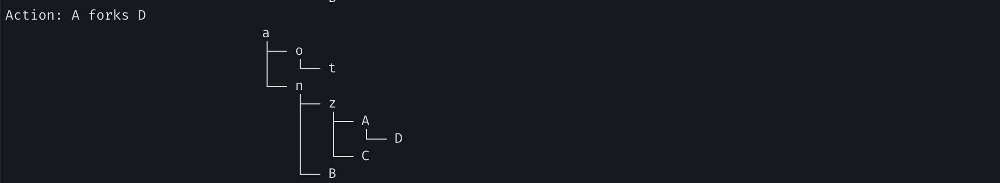

   

   ---

3. Now, switch the output by using the `-t` flag (e.g., run `./fork.py -t`). Given a set of process trees, can you tell which actions were taken?

   

   `src/fork.py -t` 실행 결과: 생성된 Process Tree의 결과를 보고 Action을 유추할 수 있어야 한다.

   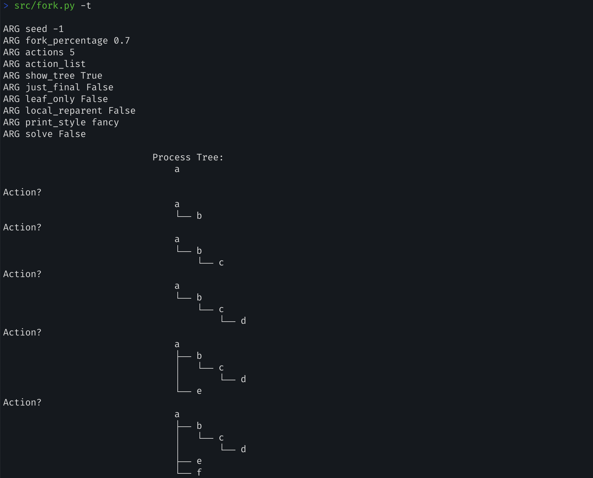

   

   `src/fork.py -t -c` 실행 결과

   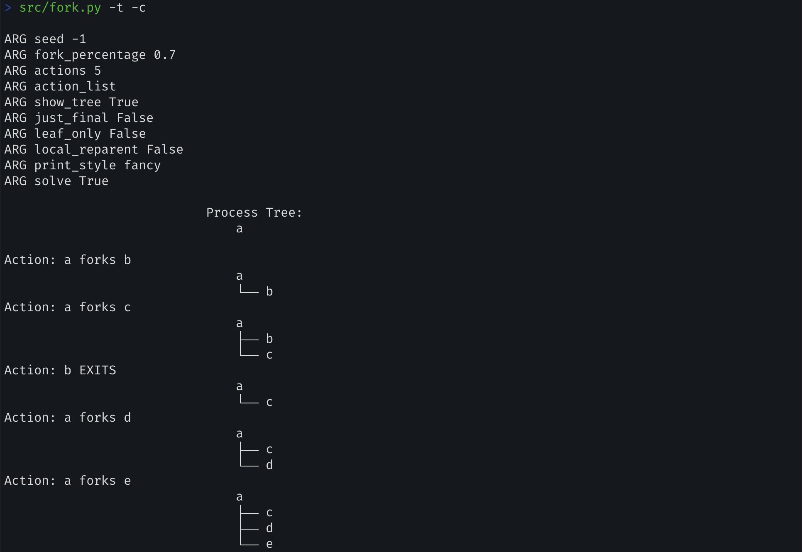

   

   ---

4. One interesting thing to note is what happens when a child exits; what happens to its children in the process tree? To study this, let’s create a specific example: `./fork.py -A a+b,b+c,c+d,c+e,c-`. This example has process ’a’ create ’b’, which in turn creates ’c’,which then creates ’d’ and ’e’. However, then, ’c’ exits. What do you think the process tree should like after the exit? What if you use the `-R` flag? Learn more about what happens to orphaned processes on your own to add more context.

   

   > **문제의 의도가 무엇일까?**
   >
   > 부모 프로세스가 자식 프로세스를 생성한 상황에서, 부모 프로세스가 exit한 경우 어떤 일이 벌어지는지 물어보는 문제인 것 같다. 사견으로는 1) 조부모 프로세스가 부모 프로세스가 되거나, 2) 부모 프로세스가 특정 상태로 돌입하고 부모인 상태는 유지할 것 같다. 
   >
   > <u>그리고 실행 결과, 둘 다 틀렸다. root process가 orphan process의 직접적인 부모가 된다.</u>
   >
   > **key point**: 부모 프로세스가 종료될 때 자식 프로세스는 어떻게 될까? -> **orphan process 처리 메카니즘**

   

   `src/fork.py -A a+b,b+c,c+d,c+e,c- -c` 실행 결과

   > -A option:  -A ACTION_LIST, --action_list=ACTION_LIST
   >
   > ​	action list, instead of randomly generated ones
   > ​	(format: a+b,b+c,b- means a fork b, b fork c, b exit)

   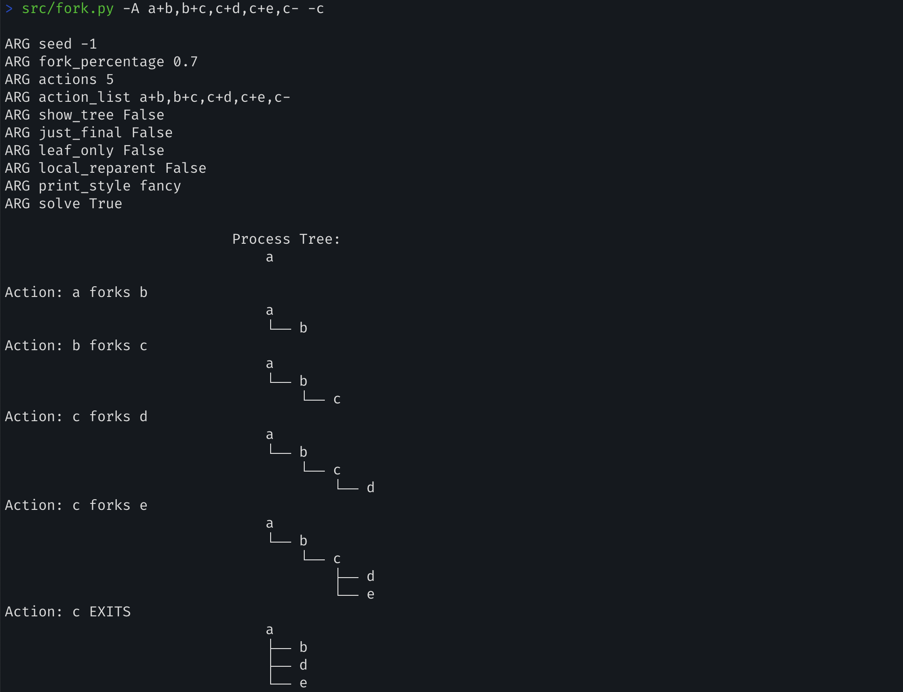

   시뮬레이션 결과, process `c`가 종료되자 child processes(`d`와 `e`)의 부모가 root process(init process)인 `a`로 재배치되었다. 이를 통해, orphan process의 처리 방식은, root process가 입양을 하는 것임을 알 수 있게 됐다.

   > Thoughts 💭 
   >
   > What is orphan process 
   >
   > 부모 프로세스가 종료되는 경우 남아있는 자식 프로세스를 orphan process라고 한다.
   >
   > How to handle orphan process 
   >
   > root process(init process, systemed)가 직접 orphan process의 부모가 된다.

   

   `src/fork.py -A a+b,b+c,c+d,c+e,c- -c -R` 실행 결과: 위와 달리 orphan process의 부모가 root process가 아닌 조부모 프로세스가 된다.

   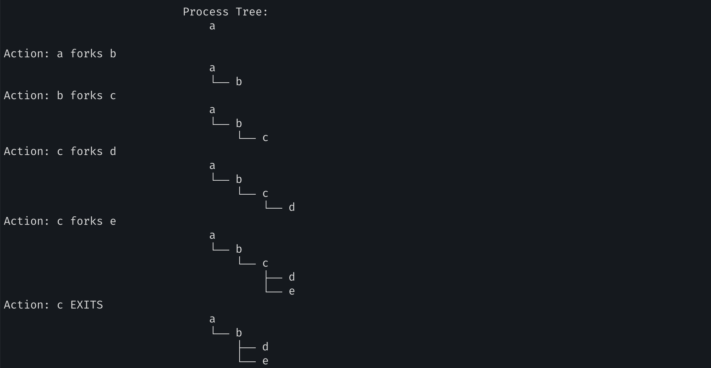

   > 위 결과에 어떤 의미가 있을까?
   >
   > -R option: 
   >
   > ​	-R, --local_reparent  reparent to local parent
   >
   > -R option을 이용하여 orphan process의 부모를 root가 아닌 조부모로 재배치한다. 즉 프로세스의 처리과정을 유연하게 할 수 있음을 보여준다. 그리고 이 방법은 이전보다 계층 구조를 더욱 잘 보존한다는 이점이 있다.

   

   ---

5. One last flag to explore is the `-F` flag, which skips intermediate steps and only asks to fill in the final process tree. Run `./fork.py -F` and see if you can write down the final tree by looking at the series of actions generated. Use different random seeds to try this a few times.

   > -F option:
   >
   >   -F, --final_only      just show final state

   `src/fork.py -F -f 0.6 -s 12` 실행 결과

   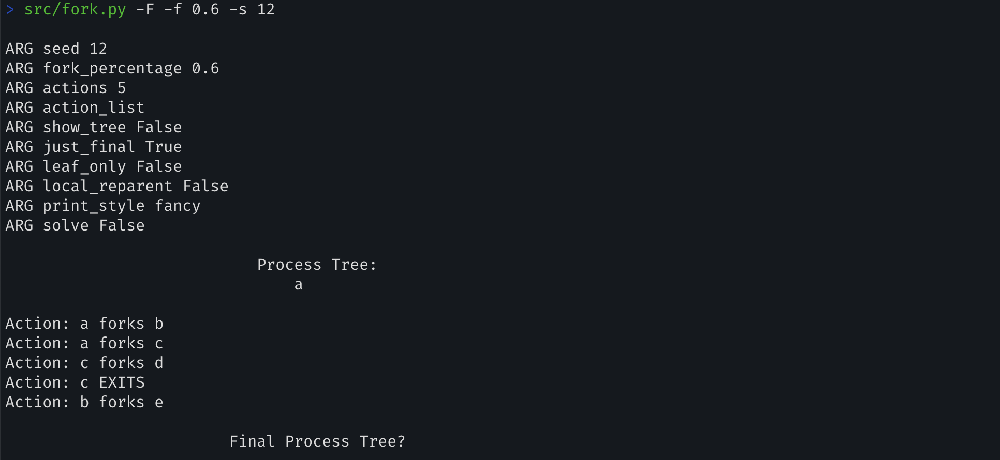

   `src/fork.py -F -f 0.6 -s 12 -c` 실행 결과

   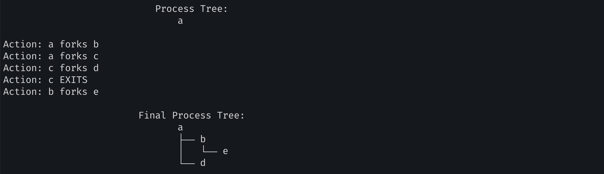

   > 문제의 의도
   >
   > 최초 프로세스와 일련의 action들(fork 또는 exit)만을 가지고 최종 Process Tree를 예측할 수 있는지 묻는 문제이다.
   >
   > 프로세스 트리의 동적 변화(fork, exit, orphan process 처리 등)에 대한 이해가 완전한지 확인할 수 있다.

   ---

6. Finally, use both `-t` and `-F` together. This shows the final process tree, but then asks you to fill in the actions that took place. By looking at the tree, can you determine the exact actions that took place? In which cases can you tell? In which can’t you tell? Try some different random seeds to delve into this question.

   > -t option
   >
   > ​	-t, --show_tree       show tree (not actions)

   `src/fork.py -F -f 0.6 -s 12 -t` 실행 결과

   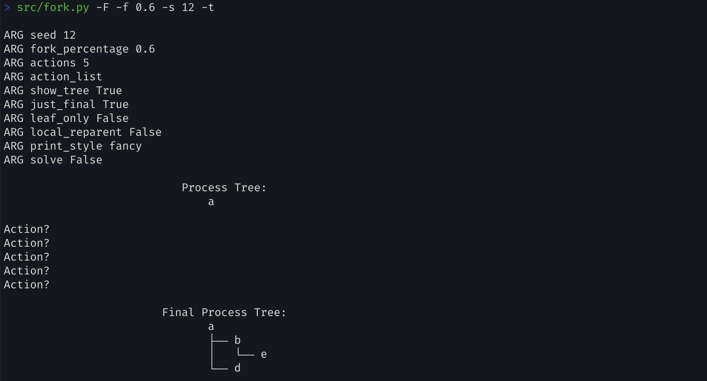

   `src/fork.py -F -f 0.6 -s 12 -t -c` 실행 결과

   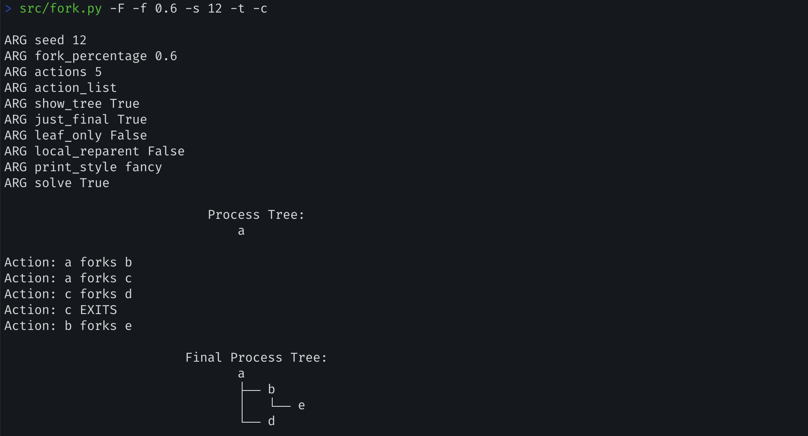

   > 문제의 의도
   >
   > process tree를 보고 actions를 예측하도록 유도한다. 다만 Action은 예측하기 쉬우나 Order는 그렇지 않다.

